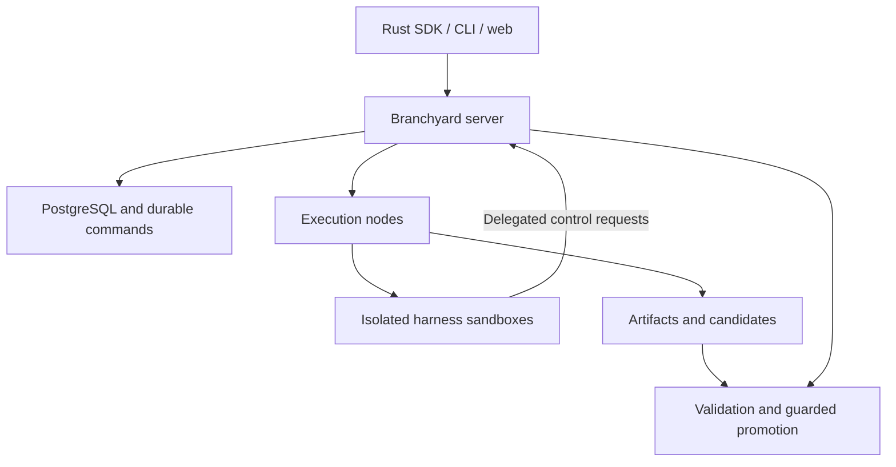

# Branchyard

**A Rust SDK for building meta-harnesses that control other coding harnesses on servers.**

A meta-harness decides how to divide work, which harnesses to use, when to create children, and which results to pursue. Branchyard supplies the control operations: execution, resource access, durable state, and validated integration.

The topology develops during execution. You define capabilities, budgets, and acceptance rules. The meta-harness creates and revises its collaborators as it discovers work.

> **Early development.** This repository contains the researched design, pinned upstream control sources, and tested Rust crates: harness protocol drivers for Claude Code, Codex, Antigravity, Pi, Amp and ACP agents, a local-mode SDK engine with the `by` command, sandbox capability admission, and Microsandbox and Agent Substrate providers. None of these is qualified against a live runtime yet. The local engine is tested only against a fake agent. A first server exposes the local engine over an authenticated HTTP API ([remote mode](#remote-mode)); it runs harnesses without isolation, and the node service and sandboxed execution are specified but not implemented.

## What you can build

A parent running Claude Code could delegate a parser change to Codex, request a review from Gemini CLI, and create another child when a dependency emerges. Each child receives a workspace, a resource budget, and scoped access. Children can delegate further when authorized. Their changes return as candidates for validation and integration.

The system is designed to support:

- **Dynamic delegation:** Create children, exchange messages, and change dependencies at runtime.
- **Server execution:** Run harnesses in isolated sandboxes with explicit compute, storage, and network limits.
- **Selective sharing:** Use private workspaces, shared read-only components, or coordinated mutable resources.
- **Durable supervision:** Preserve task state across client disconnects and reconcile failed execution attempts.
- **Validated merging:** Check exact candidate changes and promote them only against the expected target revision.

A task, a conversation, a sandbox, and a code branch have separate identities. Forking a conversation does not automatically copy its filesystem or credentials.

## Quick start (local mode)

Local mode runs the engine in-process and each harness as a local process in its own git worktree under `.branchyard/`. It needs no server, but it provides **no isolation beyond your operating-system user**: by default a harness runs with your environment, your `HOME` and your own harness login, and can read and write whatever you can. Every `CLAUDE*` variable except Claude Code configuration (provider selection, credentials, TLS client identity, limits) is removed, so a harness never runs under the identity of a Claude Code session that launched `by`. `--isolated` scrubs credentials and uses a private `HOME`, so the harness is then usually not logged in.

```sh
cargo install --locked --path crates/branchyard-cli   # installs `by`
cd path/to/your/repo
by harnesses                                          # installed harnesses and their qualification
by run "Make the flaky parser test deterministic" --check "cargo test" --max-minutes 20 --ask
by fan "Make the flaky parser test deterministic" --harness claude-code,codex --check "cargo test" --yes
by ls
by diff make-the-flaky-parser-test-deterministic-codex
by log make-the-flaky-parser-test-deterministic-codex
by merge make-the-flaky-parser-test-deterministic-codex   # runs the check on the exact merge, then moves the current branch
by rm make-the-flaky-parser-test-deterministic-claude-code
```

Every tool permission request reaches Branchyard. The Antigravity, Pi and Amp profiles cannot route them, so `by` refuses them unless you pass `--allow-unapproved-tools` (see [harness integration](docs/harness-integration.md#implemented-drivers)). `--ask` prompts on the terminal, `--yes` allows each one, and with neither flag and no terminal they are denied. `by log` shows each decision. These commands are tested end to end against a fake ACP agent; they have not yet run against a real harness. Resuming or forking a session in another worktree may fail for harnesses that keep sessions per directory, such as Claude Code; the branch then reports the failure rather than starting over silently.

State is durable in `.branchyard/state.db` (SQLite). A turn runs under its branch's lease, so two `by` processes never drive one branch, and `by cancel <branch>` stops a running turn from any terminal. If `by` is killed mid-turn, the next `by` command on the repository recovers the branch: it kills the harness's process group when its pid and start time still match, and ends the branch `interrupted`, saying whether the prompt had been submitted. A prompt is never submitted again. See [durability](docs/durability.md) for the journal, leases, recovery rules and limits.

## Remote mode

`by serve` (or the `branchyard-server` binary) serves repositories over an authenticated HTTP JSON API with Server-Sent Events, running the same engine in-process. `by --remote URL` runs every command against it with the same output; `branchyard-client` is the typed Rust client. [Surfaces](docs/surfaces.md) lists every operation on every surface, SDK, `by`, `by --remote`, HTTP, client and delegation, and what each refuses.

```sh
cd path/to/your/repo
by serve                                   # 127.0.0.1:8421; creates .branchyard/server/token
export BRANCHYARD_REMOTE=http://127.0.0.1:8421
export BRANCHYARD_TOKEN_FILE=path/to/your/repo/.branchyard/server/token
by run "Make the flaky parser test deterministic" --check "cargo test" --yes
by ls
by merge make-the-flaky-parser-test-deterministic
```

Work runs on the server: interrupting `by` stops watching, not the turn, `by cancel` stops the turn, and a retried request with the same idempotency key never runs twice. Operation status and the activity feed survive a server restart; a turn still running when the server stops is recorded as interrupted, and its branch is recovered when the server starts again. Plain HTTP binds only to loopback unless TLS is configured or `--insecure-bind` is given. The server still uses the local process provider, so **harnesses run as the server's user with no isolation**, and every token holder can direct them. There is no PostgreSQL store yet, and the server runs harnesses only through the local provider. See [the server reference](docs/server.md) for the API, authentication, deployment and what is durable.

## Watching branches

`by watch` shows every branch as a tree, forks under their parents, with status, harness, current activity (the tool running, a pending permission request, the last line of the message), turns, cost and age:

```text
by watch · /src/app · q to quit

BRANCH        HARNESS      STATUS      TURNS   COST  AGE  ACTIVITY
parser        claude-code  running         2  $0.41   3m  ▸ Bash · Running the parser tests
└ parser-alt  codex        ready           1  $0.12   1m  Rewrote the tokenizer loop
docs          gemini-cli   no changes      1      -   9m  The docs already cover this

3 branches, 1 running, $0.53 reported
```

On a terminal it redraws in place; `q` or Ctrl-C exits and restores the terminal. Piped, it prints one line per change instead, and `--once` prints the tree once. It reads event logs incrementally, and works the same with `--remote`, where it follows the server's event stream.

## Sandbox providers

A harness runs through a sandbox provider. The default **local** provider is the local mode above. The **Microsandbox** provider runs each turn's harness in a microVM booted from an OCI image with the harness installed: the branch's worktree is mounted at `/workspace`, the harness gets only `HOME` and the variables you name with `--pass-env`, and the microVM is destroyed when the turn ends.

```sh
cargo +1.94 install --locked --path crates/branchyard-cli --features microsandbox
by run "Fix the flaky parser test" --provider microsandbox --image ghcr.io/you/claude-code:2.1 \
  --cpus 2 --memory 4096 --pass-env ANTHROPIC_API_KEY --check "cargo test" --yes
```

It needs Linux with KVM and the `msb` 0.7.3 runtime, and the `microsandbox` cargo feature, which is off by default because the pinned SDK needs Rust 1.94 while the workspace pins 1.90. It is **unqualified**: its unit tests pass, but its KVM tests have not run. See [sandbox providers](docs/providers.md) for the contract, each provider's guarantees, and how to run those tests.

The **Agent Substrate** provider, in the default build, runs each turn's harness in an [Agent Substrate](docs/substrate.md) actor on Kubernetes. Substrate has no exec API, so the actor's template runs `branchyard-bridge`, which starts the harness for connections that arrive through Substrate's router carrying a credential the host signs for that attempt. An actor cannot mount the worktree: it is copied in and the result brought back as git bundles, and applied to the worktree's files so the candidate is recorded as usual.

```sh
branchyard-bridge keygen --out bridge.key       # its public key goes in the actor template
by run "Fix the flaky parser test" --provider substrate --substrate-endpoint http://127.0.0.1:8080 \
  --substrate-router 'http://127.0.0.1:8081/{atespace}/{actor}/' --substrate-template by-claude \
  --substrate-key bridge.key --pass-env ANTHROPIC_API_KEY --check "cargo test" --yes
```

It is **unqualified**: it has run only against an in-process fake cluster, the router's addressing is an assumption, and its connections are plain HTTP. See [Agent Substrate](docs/substrate.md) and [live testing](docs/testing-live.md#6-agent-substrate-cluster).

## Delegation

A harness can act as a meta-harness. With `--delegate`, the harness runs `by` in its own shell to create and coordinate child branches, within an envelope of depth, width, harnesses and budget:

```sh
by run "Split the parser rewrite: delegate the tokenizer to codex and the formatter to yourself, then integrate both" \
  --delegate --budget-usd 3 --yes
# inside the harness, as its own branch:
#   by spawn "Port the tokenizer to the new API; run its tests" --name tokenizer --harness codex --budget-usd 1
#   by inspect tokenizer --json
#   by integrate tokenizer          # merges into the parent's branch, never into yours
by ls                               # the tree
```

The same operations are a Python module, a Rust `Delegate`, and MCP tools (`by mcp`), with one authority model: a per-turn token that lets a branch act only on its descendants. In local mode that stops mistakes, not a hostile harness. See [delegation](docs/delegation.md).

## Architecture

Clients submit work and observe results. All managed harness execution happens on servers.



The planned Rust services use Tokio, Axum/Tower, SQLx/PostgreSQL, PGMQ, Cedar, OpenDAL, and Tonic. Existing sandbox runtimes supply virtualization and guest execution. The first provider to qualify is the [Microsandbox open runtime](https://microsandbox.dev/) on Linux servers. Access to its private-beta cloud service is not a dependency. [Agent Substrate](docs/substrate.md) is a second candidate for operators who already run Kubernetes.

Fast startup comes from prepared images, cached repository objects, private writable state, and available server capacity. Warm and cold startup paths will be measured separately. No latency guarantee is claimed yet.

## Harness interfaces

| Interface | Purpose |
|---|---|
| Rust SDK and server API | Durable task, graph, resource, and integration operations |
| ACP | A common client protocol for controlling compatible harness sessions |
| Native drivers | Harness-specific session, turn, permission, and lifecycle controls |
| MCP tools or thin CLI | Let a harness call Branchyard's control operations |

Use one ACP client alongside native drivers where required. Codex's App Server, Claude's Agent SDK, Antigravity's streaming CLI, and Pi-family RPC interfaces need their own qualified profiles. A structured JSON stream alone does not establish permission control or reliable recovery.

Drivers for Claude Code, Codex, Antigravity, Pi, Amp and ten ACP harnesses are [implemented](docs/harness-integration.md#implemented-drivers): 15 of the 16 targets have a default profile, and Aider, a batch process, has none. Both Claude Code profiles have passed [live protocol qualification](docs/qualification/README.md); none is yet qualified inside a sandbox. The Antigravity and Pi drivers replay transcripts recorded without a model call; the Amp driver rests on documentation only; all three are unqualified. The [integration design](docs/harness-integration.md) covers **16 harnesses**: Claude Code, Codex, Antigravity, Oh My Pi, DeepSeek Harness, Gemini CLI, OpenCode, Pi, Goose, Aider, Cursor, GitHub Copilot, Amp, Qwen Code, Kimi CLI, and Hermes. This is a researched target matrix, not a claim of deployed support.

The generated [compatibility matrix](docs/compatibility.md) lists every profile's capabilities and live qualification result.

## What is in this commit

| Component | Status |
|---|---|
| `branchyard-controls` | Dependency-free Rust resume recipes adapted from Herdr, and one harness identity registry across Herdr, Scion and the integration matrix; 15 tests pass |
| `branchyard` | The local-mode SDK engine: tasks, branches as git worktrees, forks, budgets, per-invocation permission policies, an event log per branch read from cursors, validated merges, and durable execution on SQLite (leases, journaled steps, cancellation, crash recovery; see [durability](docs/durability.md)), and turns in Substrate actors; 76 hermetic tests against a fake ACP agent, including a killed engine and turns in a fake Substrate cluster, none against a real harness |
| `branchyard-harness` | Sans-IO protocol drivers: Claude Code stream-json, Codex App Server, Antigravity stream-json, Pi RPC, Amp stream-json, and ACP v1 for ten more harnesses; 15 of 16 targets have a default profile; 68 tests, including replays of recorded Claude Code, Codex, Antigravity and Pi sessions and of documentation-derived Amp sessions, and a conformance contract run against all 17 profiles; both Claude Code profiles pass live protocol qualification |
| `branchyard-qualify` | Runs driver qualification scenarios against real harness binaries; see [driver qualification](docs/qualification/README.md) |
| `branchyard-workspace` | Git worktree branches, candidate commits and validated merges: compare-and-swap on the target, checks in a temporary worktree, conflicts returned for repair; 18 tests |
| `branchyard-runtime` | Runs a driver against a harness process through any sandbox provider, and the local provider: own process group, scrubbed environment, private home, teardown that names and kills surviving descendants; 27 hermetic tests, including the provider conformance checks, against a fake ACP agent |
| `branchyard-cli` | The `by` command on the SDK: `run`, `fan`, `send`, `fork`, `ls`, `show`, `diff`, `log`, `merge`, `rm`, `cancel`, `harnesses`, `watch`, `serve`, each also in remote mode; 65 tests, 17 of them running the built binary against temporary repositories, a spawned server, a fake Substrate cluster and a fake ACP agent |
| `branchyard-server` | The server: bearer-token authentication, durable operations with idempotency keys, cancellation, a resumable SSE activity feed read from the engine's store, recovery, TLS and graceful shutdown; 24 tests, 9 over real HTTP against a fake ACP agent; see [the server reference](docs/server.md) |
| `branchyard-client` | The remote SDK: typed blocking client, SSE parsing and reconnect by cursor; 12 tests |
| `branchyard-mcp` | Branchyard's delegation tools over MCP on stdio (`by mcp`), for harnesses whose shell is restricted; the same operations and token as `by spawn` and the SDKs |
| `branchyard-sandbox` | The vendor-independent `SandboxProvider` contract, provider conformance checks, and capability admission; unsupported requirements are rejected, never weakened |
| `branchyard-microsandbox` | A [Microsandbox](https://github.com/superradcompany/microsandbox) provider over its public SDK 0.7.3, behind the off-by-default `microsandbox` feature (the SDK needs Rust 1.94); 11 mapping tests, 4 more with the SDK, and 14 ignored tests for a KVM host; **unqualified** |
| `branchyard-substrate` | An [Agent Substrate](https://github.com/agent-substrate/substrate) `SandboxProvider` over a client generated from its unmodified proto, exec through the bridge, git transfer, the bridge's actor template, and a fake cluster for tests; 32 tests, including the conformance checks, against the fake, and 4 ignored tests for a cluster; **unqualified** |
| `branchyard-bridge` | The in-sandbox exec bridge for runtimes without an exec API: a versioned frame protocol over WebSocket, Ed25519-signed per-attempt credentials, process groups with teardown, file and tree transfer, and its host-side client; 17 tests |
| Scion controls | Nine provisioners, adjacent helpers/configuration, and tests; six suites pass with 239 tests |
| Herdr controls | Original resume source and 22 terminal-observation manifests |
| OpenRig controls | Launch/readiness contract and configuration fragments; not a standalone adapter |
| Warp controls | Separate AGPL source references for process supervision; excluded from the Rust build |
| Architecture and plan | Server design, harness contracts, implementation milestones, and release gates |

All **84 vendored files** retain upstream revisions, licenses, Git blob IDs, and SHA-256 hashes. Adaptations are recorded outside `vendor/`. [Vendoring decisions](docs/vendoring.md) explain their intended use. [Replicas](https://replicas.dev/) remains a product reference; no licensed runtime source was identified to copy.

Scion's Claude provisioner and its model-alias tests disagree at the pinned revision. CI reproduces that exact incompatibility separately; the provisioner remains unqualified. See [validation](docs/validation.md).

## Try the current crates

Use the pinned Rust toolchain and Python 3.12. These commands validate the foundation without provider credentials or a sandbox host. Only `cargo fetch` uses the network:

```sh
cargo fetch --locked
cargo test --workspace --locked --offline
cargo run --locked --offline -p branchyard-controls --example plan_resume
python3 tools/verify_vendor.py
python3 tools/test_scion.py --qualified
python3 tools/check_scion_compatibility.py
```

The example prints a resume argument vector. It does not launch a harness. The crate does not authorize sessions; callers must verify tenant, workspace, session ownership, and executable compatibility before using a recipe.

## Build next

Start with one complete remote task: shared contracts, a qualified sandbox provider, durable commands, one harness driver, and artifact capture. Then add dynamic children, resource sharing, guarded integration, and additional profiles.

- [Architecture](docs/design.md): ownership, topology, compute, networking, storage, budgets, and recovery.
- [Harness integration](docs/harness-integration.md): interfaces, callback placement, session semantics, and qualification.
- [Implementation plan](docs/implementation-plan.md): ordered milestones and acceptance gates.
- [Contributing](CONTRIBUTING.md): implementation boundaries and validation workflow.

## License

Branchyard-authored code is **Apache-2.0**. Vendored components retain their upstream licenses. `vendor/warp-agpl/` contains AGPL source references and is not linked into the Apache-licensed crate. The repository therefore contains multiple licenses. See [third-party notices](THIRD_PARTY.md).
