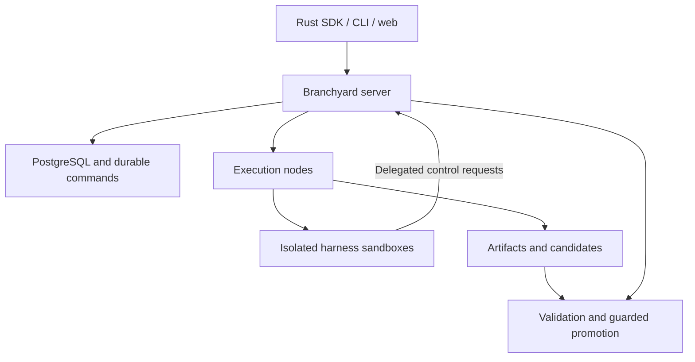

# Branchyard

**A Rust SDK for building meta-harnesses that control other coding harnesses on servers.**

A meta-harness decides how to divide work, which harnesses to use, when to create children, and which results to pursue. Branchyard supplies the control operations: execution, resource access, durable state, and validated integration.

The topology develops during execution. You define capabilities, budgets, and acceptance rules. The meta-harness creates and revises its collaborators as it discovers work.

> **Early development.** This repository contains the researched design, pinned upstream control sources, and tested Rust crates: harness protocol drivers for Claude Code, Codex and ACP agents, sandbox capability admission, and an Agent Substrate adapter. None of these is qualified against a live runtime yet. The public task SDK and server are specified but not implemented.

## What you can build

A parent running Claude Code could delegate a parser change to Codex, request a review from Gemini CLI, and create another child when a dependency emerges. Each child receives a workspace, a resource budget, and scoped access. Children can delegate further when authorized. Their changes return as candidates for validation and integration.

The system is designed to support:

- **Dynamic delegation:** Create children, exchange messages, and change dependencies at runtime.
- **Server execution:** Run harnesses in isolated sandboxes with explicit compute, storage, and network limits.
- **Selective sharing:** Use private workspaces, shared read-only components, or coordinated mutable resources.
- **Durable supervision:** Preserve task state across client disconnects and reconcile failed execution attempts.
- **Validated merging:** Check exact candidate changes and promote them only against the expected target revision.

A task, a conversation, a sandbox, and a code branch have separate identities. Forking a conversation does not automatically copy its filesystem or credentials.

## Architecture

Clients submit work and observe results. All managed harness execution happens on servers.



The planned Rust services use Tokio, Axum/Tower, SQLx/PostgreSQL, PGMQ, Cedar, OpenDAL, and Tonic. Existing sandbox runtimes supply virtualization and guest execution. The first provider to qualify is the [Microsandbox open runtime](https://microsandbox.dev/) on Linux servers. Access to its private-beta cloud service is not a dependency. [Agent Substrate](docs/substrate.md) is a second candidate for operators who already run Kubernetes.

Fast startup comes from prepared images, cached repository objects, private writable state, and available server capacity. Warm and cold startup paths will be measured separately. No latency guarantee is claimed yet.

## Harness interfaces

| Interface | Purpose |
|---|---|
| Rust SDK and server API | Durable task, graph, resource, and integration operations |
| ACP | A common client protocol for controlling compatible harness sessions |
| Native drivers | Harness-specific session, turn, permission, and lifecycle controls |
| MCP tools or thin CLI | Let a harness call Branchyard's control operations |

Use one ACP client alongside native drivers where required. Codex's App Server, Claude's Agent SDK, Antigravity's streaming CLI, and Pi-family RPC interfaces need their own qualified profiles. A structured JSON stream alone does not establish permission control or reliable recovery.

Drivers for Claude Code, Codex and ten ACP harnesses are [implemented](docs/harness-integration.md#implemented-drivers). Both Claude Code profiles have passed [live protocol qualification](docs/qualification/README.md); none is yet qualified inside a sandbox. The [integration design](docs/harness-integration.md) covers **16 harnesses**: Claude Code, Codex, Antigravity, Oh My Pi, DeepSeek Harness, Gemini CLI, OpenCode, Pi, Goose, Aider, Cursor, GitHub Copilot, Amp, Qwen Code, Kimi CLI, and Hermes. This is a researched target matrix, not a claim of deployed support.

The generated [compatibility matrix](docs/compatibility.md) lists every profile's capabilities and live qualification result.

## What is in this commit

| Component | Status |
|---|---|
| `branchyard-controls` | Dependency-free Rust resume recipes adapted from Herdr, and one harness identity registry across Herdr, Scion and the integration matrix; 15 tests pass |
| `branchyard-harness` | Sans-IO protocol drivers: Claude Code stream-json, Codex App Server, and ACP v1 for ten more harnesses; 12 of 16 targets have a default profile; 35 tests, including replays of recorded Claude Code and Codex sessions; both Claude Code profiles pass live protocol qualification |
| `branchyard-qualify` | Runs driver qualification scenarios against real harness binaries; see [driver qualification](docs/qualification/README.md) |
| `branchyard-sandbox` | Vendor-independent sandbox capabilities and admission checks; unsupported requirements are rejected, never weakened |
| `branchyard-substrate` | [Agent Substrate](https://github.com/agent-substrate/substrate) provider adapter over a client generated from its unmodified proto; tested against an in-process fake, **unqualified** against a cluster |
| Scion controls | Nine provisioners, adjacent helpers/configuration, and tests; six suites pass with 239 tests |
| Herdr controls | Original resume source and 22 terminal-observation manifests |
| OpenRig controls | Launch/readiness contract and configuration fragments; not a standalone adapter |
| Warp controls | Separate AGPL source references for process supervision; excluded from the Rust build |
| Architecture and plan | Server design, harness contracts, implementation milestones, and release gates |

All **84 vendored files** retain upstream revisions, licenses, Git blob IDs, and SHA-256 hashes. Adaptations are recorded outside `vendor/`. [Vendoring decisions](docs/vendoring.md) explain their intended use. [Replicas](https://replicas.dev/) remains a product reference; no licensed runtime source was identified to copy.

Scion's Claude provisioner and its model-alias tests disagree at the pinned revision. CI reproduces that exact incompatibility separately; the provisioner remains unqualified. See [validation](docs/validation.md).

## Try the current crates

Use the pinned Rust toolchain and Python 3.12. These commands validate the foundation without provider credentials or a sandbox host. Only `cargo fetch` uses the network:

```sh
cargo fetch --locked
cargo test --workspace --locked --offline
cargo run --locked --offline -p branchyard-controls --example plan_resume
python3 tools/verify_vendor.py
python3 tools/test_scion.py --qualified
python3 tools/check_scion_compatibility.py
```

The example prints a resume argument vector. It does not launch a harness. The crate does not authorize sessions; callers must verify tenant, workspace, session ownership, and executable compatibility before using a recipe.

## Build next

Start with one complete remote task: shared contracts, a qualified sandbox provider, durable commands, one harness driver, and artifact capture. Then add dynamic children, resource sharing, guarded integration, and additional profiles.

- [Architecture](docs/design.md): ownership, topology, compute, networking, storage, budgets, and recovery.
- [Harness integration](docs/harness-integration.md): interfaces, callback placement, session semantics, and qualification.
- [Implementation plan](docs/implementation-plan.md): ordered milestones and acceptance gates.
- [Contributing](CONTRIBUTING.md): implementation boundaries and validation workflow.

## License

Branchyard-authored code is **Apache-2.0**. Vendored components retain their upstream licenses. `vendor/warp-agpl/` contains AGPL source references and is not linked into the Apache-licensed crate. The repository therefore contains multiple licenses. See [third-party notices](THIRD_PARTY.md).
