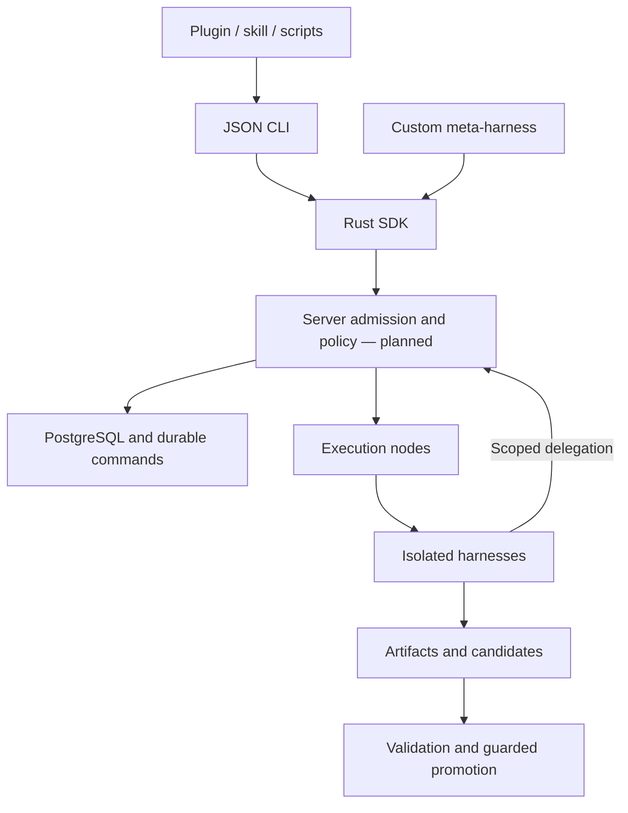

# Branchyard

**A Rust SDK for meta-harnesses that control other coding harnesses on servers.**

Your harness decides how to divide work, which collaborators to create, and what
to do with their results. Branchyard provides the control contract for tasks,
dynamic graph changes, workspace isolation, resource access and eventual integration.
The topology develops during execution; it is not a statically configured committee.

> **Early development:** the Rust protocol, remote SDK, JSON CLI and portable
> skill/plugin are implemented and tested against HTTP fixtures. The production
> server, sandbox execution, harness drivers and validated merging remain planned.
> Installing the plugin does not provision a sandbox or start a worker.

## Try it now

Build with the pinned Rust 1.90 toolchain and platform C/CMake build tools:

```sh
cargo build --locked -p branchyard-cli
./target/debug/branchyard describe
./target/debug/branchyard validate --file examples/commands/create-task.json
./target/debug/branchyard new-id
```

These commands run without server or model credentials. The JSON examples are
request templates; their profile names, IDs and revisions are not live resources.
For an installed binary: `cargo install --locked --path crates/branchyard-cli`.
The crates are not yet published to crates.io.

With a compatible server and a scoped credential supplied through
`BRANCHYARD_ENDPOINT` and `BRANCHYARD_TOKEN`:

```sh
branchyard doctor
branchyard call --file request.json
branchyard reconcile --file request.json
branchyard task TASK_UUID
branchyard events TASK_UUID --after 0 --limit 50
```

Persist the request before submitting it. A timeout can follow successful
admission: reconcile the same operation ID instead of creating another task.
Dropping a client does not cancel work. Cancellation is an explicit command.

## One contract, several entry points

| Component | What is implemented |
|---|---|
| `branchyard-protocol` | Typed identities, task specs, graph deltas, cancellation, receipts, bounded event pages and generated JSON schemas |
| `branchyard-sdk` | Async HTTP client; pooled connections, explicit deadlines, bounded responses, identity checks and uncertain-outcome reconciliation |
| `branchyard` CLI | Offline describe/validate, remote submit/reconcile/inspect, readiness and event pages; JSON output |
| Skill and plugin | One canonical skill, Codex/Claude manifests, standalone installer, launcher and reproducible archives |
| `branchyard-controls` | Tested resume recipes adapted from Herdr |
| Upstream controls | 82 pinned files from Scion, Herdr, OpenRig and Warp, with hashes and license boundaries |

The CLI and skill call the SDK's operations. They contain no second planner,
execution engine or task journal. The plugin follows
[lessons from Straitjacket](docs/straitjacket.md): shared mechanisms, explicit
capabilities, bounded evidence and distribution checks outside the source tree.

## Use it from a harness

Any harness with a terminal can call the CLI. A custom Rust harness can use
`branchyard-sdk`; other clients can use the [HTTP contract](docs/control-api.md).
ACP is not required to call Branchyard.

Install the [plugin](plugins/branchyard/README.md), or copy its canonical skill
into a host's explicitly chosen skill directory:

```sh
python3 plugins/branchyard/scripts/install_skill.py --destination /path/to/project/.agents/skills
python3 plugins/branchyard/scripts/install_skill.py --destination /path/to/project/.agents/skills --apply
python3 tools/package.py --output dist
```

The installer previews first and refuses to overwrite an existing skill. Install
one form per host. Archives include the skill and scripts; the CLI is installed
separately. Packaging is tested; live plugin loading in every host is not qualified.
MCP-only hosts need a future adapter; no MCP facade is shipped yet.

## Server architecture

All managed harness execution belongs on servers. Clients prepare, submit and
observe remote work.



A task, conversation, sandbox, workspace and integration candidate have distinct
identities. Forking a workspace does not inherit credentials or imply a native
conversation fork. Shared components require explicit access and enforced ownership.
Graph proposals change ownership/dependencies at runtime; physical placement is
an independent decision.

The planned backend uses Tokio/Axum, SQLx/PostgreSQL, PGMQ, Cedar, OpenDAL and
Tonic. Existing runtimes provide virtualization and guest execution. The first
qualification target is the [Microsandbox open runtime](https://microsandbox.dev/)
on Linux servers; its private-beta hosted service is not a dependency. Prepared
images, cached source and available warm capacity will be measured separately
from harness startup. No sub-second latency result is claimed.

## Controlling other harnesses

The inbound SDK/CLI is separate from the server's outbound driver interfaces:

| Interface | Responsibility |
|---|---|
| Branchyard SDK / HTTP / CLI | Tasks, graph proposals, observation and recovery |
| ACP client | Control a compatible harness session inside a sandbox |
| Native driver | Preserve harness-specific sessions, permissions and lifecycle |
| Future MCP tools | Let an MCP host invoke the same Branchyard operations |

The [driver research](docs/harness-integration.md) covers Claude Code, Codex,
Antigravity, Oh My Pi, DeepSeek Harness, Gemini CLI, OpenCode, Pi, Goose, Aider,
Cursor, GitHub Copilot, Amp, Qwen Code, Kimi CLI and Hermes. These sixteen are
integration targets, not deployed support. Qualify one ACP profile and one native
driver against the same contract before expanding the roster.

## Build next

The next gate is durable server admission: authenticate, validate, reserve, write
the operation and queue command in one transaction, then survive a lost response.
Sandbox qualification and one remote task follow. Recursive execution, shared
resource fencing and validated Git promotion each have separate acceptance gates.

- [SDK and packaging guide](docs/sdk.md)
- [Control API and server obligations](docs/control-api.md)
- [Architecture](docs/design.md)
- [Implementation plan](docs/implementation-plan.md)
- [Validation and reproduction](docs/validation.md)
- [Contributing](CONTRIBUTING.md)

## License

Branchyard-authored code is **Apache-2.0**. Vendored components retain upstream
licenses. `vendor/warp-agpl/` contains unlinked AGPL source references, excluded
from the Rust build. Scion's pinned Claude provisioner has a recorded test mismatch
and remains unqualified. See [third-party notices](THIRD_PARTY.md),
[vendoring decisions](docs/vendoring.md) and [validation](docs/validation.md).
