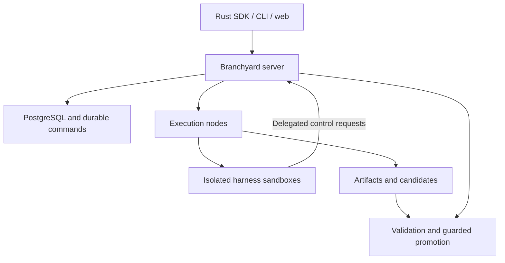

# Branchyard

**A Rust SDK for building meta-harnesses that control other coding harnesses on servers.**

A meta-harness decides how to divide work, which harnesses to use, when to create children, and which results to pursue. Branchyard supplies the control operations: execution, resource access, durable state, and validated integration.

The topology develops during execution. You define capabilities, budgets, and acceptance rules. The meta-harness creates and revises its collaborators as it discovers work.

> **Early development.** This repository contains the researched design, pinned upstream control sources, and tested Rust crates: harness protocol drivers for Claude Code, Codex, Antigravity, Pi, Amp and ACP agents, a local-mode SDK engine with the `by` command, sandbox capability admission, and Microsandbox and Agent Substrate providers. None of these is qualified against a live runtime yet. The local engine is tested only against a fake agent. A first server exposes the local engine over an authenticated HTTP API ([remote mode](#remote-mode)); it runs harnesses without isolation, and the node service and sandboxed execution are specified but not implemented.

## What you can build

A parent running Claude Code could delegate a parser change to Codex, request a review from Gemini CLI, and create another child when a dependency emerges. Each child receives a workspace, a resource budget, and scoped access. Children can delegate further when authorized. Their changes return as candidates for validation and integration.

The system is designed to support:

- **Dynamic delegation:** Create children, exchange messages, and change dependencies at runtime.
- **Server execution:** Run harnesses in isolated sandboxes with explicit compute, storage, and network limits.
- **Selective sharing:** Use private workspaces, shared read-only components, or coordinated mutable resources.
- **Durable supervision:** Preserve task state across client disconnects and reconcile failed execution attempts.
- **Validated merging:** Check exact candidate changes and promote them only against the expected target revision.

A task, a conversation, a sandbox, and a code branch have separate identities. Forking a conversation does not automatically copy its filesystem or credentials.

## Install

Prebuilt `by` and `branchyard-server` for Linux (static, x86_64 and aarch64) and macOS (Apple silicon and Intel) come with each release, with SHA-256 checksums and build provenance attestations. Download `install.sh` from the release, read it, and run it; it verifies the archive against `SHA256SUMS` and installs into `~/.local/bin` without `sudo` ([distribution](docs/distribution.md#prebuilt-binaries)). Or build from source:

```sh
cargo install --locked --path crates/branchyard-cli   # installs `by`
```

A container image with Claude Code, Codex and claude-agent-acp pinned and integrity-checked is `deploy/Dockerfile.harnesses` ([deploy](docs/deploy.md#image-with-harnesses)).

## Quick start

```sh
cargo install --locked --path crates/branchyard-cli   # installs `by`
cd path/to/your/repo
by init                                               # set up by interview
by init project --defaults                            # or: one topic, every default
```

`by init` asks what to set up and interviews you in the terminal: it detects your installed harnesses, credential variables (by name only), the repository's check command, docker and KVM, shows every file it would write as a diff checked by the loader that reads it, and writes only after you agree. A repository already set up for emdash, Orca, Superset or Conductor gets the same `[workspace]` suggested from their committed file ([setup](docs/setup.md#importing-another-tools-workspace-configuration)). Topics: `project` (`branchyard.toml`: default harness, model, limits, permissions, isolation, check, secrets by name, a server to use), `server` (a server configuration with hashed per-tenant credentials, 0600 token files and quotas), `rig`, `deploy` (compose with PostgreSQL) and `plugin`.

Or let your coding harness do it. `by init plugin` installs the `setup` skill into Claude Code or Codex (or load the whole plugin with `claude --plugin-dir plugins/branchyard`); then ask it to "set up Branchyard" or run `/branchyard:setup`. It drives the same interview through `by init TOPIC --json --next`, asks you each batch with its own question tool, shows the dry-run diff, and applies after you confirm. See [setup](docs/setup.md) for both front-ends, the protocol and `branchyard.toml`; `by config show` prints every effective value and where it came from.

## Local mode

Local mode runs the engine in-process and each harness as a local process in its own git worktree under `.branchyard/`. It needs no server, but it provides **no isolation beyond your operating-system user**: by default a harness runs with your environment, your `HOME` and your own harness login, and can read and write whatever you can. Every `CLAUDE*` variable except Claude Code configuration (provider selection, credentials, TLS client identity, limits) is removed, so a harness never runs under the identity of a Claude Code session that launched `by`. `--isolated` scrubs credentials and uses a private `HOME`, so the harness is then usually not logged in; `--secret` [provisions](docs/provisioning.md) a credential into that home.

```sh
by harnesses                                          # installed harnesses and their qualification
by harnesses --all                                    # every harness CLI Branchyard knows of: install, login, API keys
by run "Make the flaky parser test deterministic" --check "cargo test" --max-minutes 20 --ask
by fan "Make the flaky parser test deterministic" --harness claude-code,codex --check "cargo test" --yes
by ls
by diff make-the-flaky-parser-test-deterministic-codex
by log make-the-flaky-parser-test-deterministic-codex
by merge make-the-flaky-parser-test-deterministic-codex   # runs the check on the exact merge, then moves the current branch
by rm make-the-flaky-parser-test-deterministic-claude-code
```

From an issue to a pull request, through the GitHub CLI `gh` ([pull requests](docs/pull-requests.md)):

```sh
by run --issue 42 --check "cargo test" --yes     # the issue is the task; branch issue-42-<slug>
by pr issue-42-parser-crash                       # check the candidate, push it, open or update the PR
by pr issue-42-parser-crash --watch --yes         # CI failures and review comments go back into the branch,
                                                  # and the threads a pushed fix addressed are resolved
by review issue-42-parser-crash                   # comment on the diff in your editor; all comments go as one prompt
by show issue-42-parser-crash                     # merge readiness: check, PR, CI, threads, mergeability
by open issue-42-parser-crash --editor cursor     # the worktree in your editor ($VISUAL, $EDITOR)
by run --issue linear:ENG-123 --yes               # or jira:PROJ-7, gitlab:group/project#12, or the issue's URL
by run --pr 7 "add a benchmark" --yes             # continue a pull request from its head; by pr updates it
```

Your harness logins, and the sessions already in them ([usage](docs/usage.md)):

```sh
by usage                                          # each Claude Code and Codex login's 5-hour and weekly use, and resets
by adopt                                          # this repository's Claude Code and Codex sessions
by adopt 0b5e7a1c --name faster                   # make one a branch; by send faster "…" resumes it
```

`[usage] guard = "refuse"` stops `by run` and `by fan` on a login near its limit (the default warns), and `skip_over` makes the router pass such a candidate over. The meters read only the harnesses' own session files: Codex records its rate limits there; Claude Code only tokens, so its percent needs a budget you set.

Every tool permission request reaches Branchyard. The Antigravity, Pi and Amp profiles cannot route them, so `by` refuses them unless you pass `--allow-unapproved-tools` (see [harness integration](docs/harness-integration.md#implemented-drivers)). `--ask` prompts on the terminal, `--yes` allows each one, and with neither flag and no terminal they are denied. `by log` shows each decision. These commands are tested end to end against a fake ACP agent. Against a real harness, one `by run` → `by diff` → `by merge` has run with Claude Code 2.1.283 ([validation](docs/validation.md)); the rest is on the [live testing checklist](docs/testing-live.md). Resuming or forking a session in another worktree may fail for harnesses that keep sessions per directory, such as Claude Code; the branch then reports the failure rather than starting over silently.

A fresh worktree has no `.env`, no dependencies and no dev server. `[workspace]` in `branchyard.toml` fixes that for every new branch: it copies untracked files such as `.env` from the repository root, runs `setup` (an install) before the first turn, gives scripts and the harness `BRANCHYARD_BRANCH`, `BRANCHYARD_WORKTREE`, `BRANCHYARD_ROOT` and a port of its own in `BRANCHYARD_PORT`, runs named scripts with `by workspace run <branch> [name]`, and runs `teardown` on `by rm` or `by merge --rm`. A repository's scripts never run until you trust them (`by workspace trust`, or once on a terminal), and trust lapses when they change. See [workspace](docs/workspace.md).

A repository can also say how to make a machine to work on: `[recipes.NAME]` names scripts that create, suspend, resume and destroy a VM (or a container) and print how to reach it, trusted like `[workspace]`; `by recipe check NAME` runs its doctor and a create, exec, suspend, resume and destroy, through a sandbox provider that runs commands there over ssh; `by run --provider recipe:NAME` runs a branch's harness on such a machine, the worktree copied there and back ([recipes](docs/recipes.md), ported from Orca).

With `prepare = true`, setup runs once per environment key (the setup commands, copy globs and lockfiles) and every later branch with that key starts from what it produced: cloned where the filesystem can, linked for `share` directories such as `node_modules`, or, in a sandbox, branched from a snapshot of a sandbox setup ran in. A failed build never replaces the last good one, and branches that fall back say so. A `.worktreeinclude` file is honoured. `by env list|show|rebuild|prune` manages them. See [prepared environments](docs/environments.md). With `[workspace.pool]`, worktrees wait ready with the environment in place, so a new branch starts without waiting for either; `by serve` and `by worker` refill them, `by env pool fill|status|drain` manages them locally. See [warm pools](docs/pools.md).

```toml
[workspace]
copy = [".env", ".env.*"]
setup = "pnpm install --frozen-lockfile"
[workspace.run.dev]
command = "PORT=$BRANCHYARD_PORT pnpm dev"
```

A branch can use GitHub, Slack or an internal API without holding a credential: [connectors](docs/connectors.md) compiled by [Anvil](https://github.com/vamsiramakrishnan/anvil) give its harness a skill, a CLI and an SDK per granted connector, and one gateway that holds your upstream authorizations, enforces the branch's grant and logs every call. Branchyard signs a short-lived token per turn for exactly that grant; a delegated child's is only ever narrower.

```toml
[connectors]
gateway = "http://127.0.0.1:8931/mcp"
bundles = "../connectors"                  # Anvil bundles, one directory each
anvil = "node /opt/anvil/packages/cli/dist/bin-anvil.js"
```

```sh
by gateway start                                  # Anvil's gateway, supervised, in branchyard mode
by connect github                                 # authorize your account once; the gateway keeps the token
by run "Triage the open issues" --isolated --connector github:read --yes
by log triage-the-open-issues                     # connector: github github.issues.list allowed (200, 17 ms)
```

State is durable in `.branchyard/state.db` (SQLite). A turn runs under its branch's lease, so two `by` processes never drive one branch, and `by cancel <branch>` stops a running turn from any terminal. If `by` is killed mid-turn, the next `by` command on the repository recovers the branch: it kills the harness's process group when its pid and start time still match, and ends the branch `interrupted`, saying whether the prompt had been submitted. A prompt is never submitted again. See [durability](docs/durability.md) for the journal, leases, recovery rules and limits.

## Remote mode

`by serve` (or the `branchyard-server` binary) serves repositories over an authenticated HTTP JSON API with Server-Sent Events, running the same engine in-process. `by --remote URL` runs every command against it with the same output; `branchyard-client` is the typed Rust client. [Surfaces](docs/surfaces.md) lists every operation on every surface, SDK, `by`, `by --remote`, HTTP, client and delegation, and what each refuses.

```sh
cd path/to/your/repo
by serve                                   # 127.0.0.1:8421; creates .branchyard/server/token
export BRANCHYARD_REMOTE=http://127.0.0.1:8421
export BRANCHYARD_TOKEN_FILE=path/to/your/repo/.branchyard/server/token
by run "Make the flaky parser test deterministic" --check "cargo test" --yes
by ls
by merge make-the-flaky-parser-test-deterministic
```

A repository on a machine you can `ssh` to needs no server setup: `by --remote ssh://me@build.example/srv/app run …` starts `by serve` there on a Unix socket in a private directory, forwards it through an ssh control master, and fetches a token generated there into a 0600 file; `by remote ssh status|stop` manage it ([remote over ssh](docs/remote-ssh.md)).

For more than one user, TLS, PostgreSQL, quotas or webhooks, `by init server` writes a configuration with a hashed credential per tenant and each token in a 0600 file, checks it with the server's own loader, and prints the `by serve --config … --check` and `by serve --config …` to run.

Work runs on the server: interrupting `by` stops watching, not the turn, `by cancel` stops the turn, and a retried request with the same idempotency key never runs twice. Operation status and the activity feed survive a server restart; a turn still running when the server stops is recorded as interrupted, and its branch is recovered when the server starts again; an operation still queued runs then. Plain HTTP binds only to loopback unless TLS is configured or `--insecure-bind` is given. By default the server uses the local process provider, so **harnesses run as the server's user with no isolation**, and every token holder can direct them. Its operator can allow the Microsandbox and Substrate providers (`--allow-provider`), delegation for its harnesses and remote `by spawn`, `inspect`, `events`, `integrate` and `children` (`--allow-delegation`), and unapproved tools (`--allow-unapproved-tools`); `by --remote` then takes the same flags as local `by`. `by serve --database postgres://…` keeps branch state, operations and their dispatch queue in PostgreSQL (the `postgres` feature), where several servers and `by worker` processes may share them; an operation admitted before a crash runs once, on whichever worker claims it. Workers carry labels (`by worker --label gpu`) and claim only operations whose `--require-label`s they carry; one that no live worker can claim says why ([worker labels](docs/server.md#worker-labels)). Workers claim the highest priority first (`--priority -10..10` on `by --remote` commands, capped per tenant), then the tenant furthest below its weighted fair share, with aging so low-priority work cannot starve ([scheduling](docs/server.md#scheduling)). The server serves Prometheus metrics at `/metrics` (`--metrics`, `--metrics-addr`) and exports OpenTelemetry traces of each operation, from admission through its claim to every turn, tool call and connector call, when `OTEL_EXPORTER_OTLP_ENDPOINT` is set; each turn's harness gets the trace as `TRACEPARENT` ([observability](docs/observability.md)). See [the server reference](docs/server.md) for the API, authentication, deployment and what is durable.

## Command line

`by --help` lists the commands by group; `by help <command>` (or `by <command> --help`, `-h` for a summary) shows a command's options under headings such as *Checks and limits*, *Permissions*, *Launch*, *Provisioning* and *Global options*, with examples for the main commands. Nested commands have their own help: `by help graph apply`, `by artifact publish --help`. A mistyped command or flag gets a suggestion (`by mrege` → `merge`), and a usage error exits with status 2, a failed command with 1.

The global options choose where commands run, and may come before or after the command; each falls back to its variable, and a flag wins over its variable. Under both sits the configuration, `branchyard.toml` in the repository and `~/.config/branchyard/config.toml` ([setup](docs/setup.md#configuration)): it fills only what the command line and the variables left unset, so the order is flags, then variables, then the project file, then the user file:

| Option | Variable |
|---|---|
| `--remote URL` | `BRANCHYARD_REMOTE` |
| `--token-file FILE` | `BRANCHYARD_TOKEN_FILE` |
| `--repo NAME` | `BRANCHYARD_REPO` |
| `--ca-file FILE` | `BRANCHYARD_CA_FILE` |

Pull requests: `by pr BRANCH [--git-remote NAME] [--head BRANCH] [--base BRANCH] [--title T] [--draft] [--no-check | --allow-failing-check] [--allow-not-ready] [--json]`, and with `--watch [--interval SECS] [--max-rounds N] [--no-resolve]`; `by review BRANCH [--print] [--editor E] [--file FILE] [--detach]`; `by run|fan|spawn --issue URL|#N|N|linear:KEY|jira:KEY|gitlab:PATH#N` (Linear, Jira and GitLab through their APIs with tokens from the environment, or a connector gateway); `by run|fan --pr N`; `by show BRANCH --refresh`; `by open BRANCH [--editor NAME|--print]`. `by pr` pushes to `--git-remote`, since `--remote` is the global option naming a server; `by pr`, `by open` and `by show --refresh` are local-mode only ([pull requests](docs/pull-requests.md)).

Triggers ([triggers](docs/triggers.md)): `by trigger add NAME (--cron EXPR [--tz ZONE] | --every DURATION | --on github|slack|linear|generic|postmark|mailgun|sendgrid) --prompt TEXT [--if FIELD=VALUE]... [--precheck CMD] [--harness H | --auto [--kind K]] [--branch-name TEMPLATE] [--pause-after N] [--catch-up DURATION] [--secret-file FILE]`, `by trigger list|show|test [--event FILE] [--precheck]|enable|disable|rm|runs [--limit N]|secret [--secret-file FILE] NAME`, each with `--json`, locally and with `--remote`.

`by workspace show [BRANCH]|trust|untrust|run [BRANCH] [NAME...] [--detach]|ports [BRANCH]|browse [BRANCH] [--port N] [--print]|kill [BRANCH] [--port N] [--yes] [--json]` manages a repository's [workspace](docs/workspace.md) scripts, runs them (several at once with `--detach`, each with its own port), and finds, opens and stops what each branch listens on. `by usage [--json]` meters the local logins and `by adopt [--list] [SESSION] [--name N] [--harness ID] [--no-diff] [--json]` adopts their sessions ([usage](docs/usage.md)). `by env list|show [KEY]|rebuild|prune [KEY...] [--keep N] [--older-than DAYS]` manages its [prepared environments](docs/environments.md), and `by env pool status|fill|drain` its [warm pool](docs/pools.md).

Routing and judging ([fleet](docs/fleet.md)): `by run|fan [--auto] [--kind KIND] [--seed N]`, `by fan --auto [--attempts N] [--judge]`, `by judge <FAN|BRANCH...> [--harness ID [--command CMD] | --deterministic] [--rubric TEXT] [--pick [--into T] [--discard-others] [--yes]] [--json]`, `by fleet stats [--kind KIND]|route PROMPT [--kind KIND] [--attempts N] [--seed N] [--json]`; local mode only.

Plans and goals ([plans and goals](docs/plans-and-goals.md)): `by run|fan --plan` (and `[fleet.<kind>] plan = true`), `by plan show|approve [--edit [--editor E] | --file FILE]|reject [--reason TEXT] [--replan] BRANCH [--json]`, `by spawn --plan`; `by run|fan --goal TEXT [--goal-rounds N] [--goal-judge ID [--goal-judge-command CMD]]` (and `[fleet.<kind>] goal_judge`). Repository knowledge ([knowledge](docs/knowledge.md)): `by knowledge list [--status S|--all]|show ID|review|adopt ID...|reject ID... [--reason T]|edit ID [--text T] [--path GLOB] [--kind K]|add TEXT [--path GLOB] [--kind K] [--propose]|rm ID|distill BRANCH [--harness ID [--command CMD]|--deterministic]|export [--out FILE]`, each with `--json`, and `[knowledge]` in `branchyard.toml`. All work locally and with `--remote`.

Wide map ([map](docs/map.md)): `by map PROMPT [--items FILE | --from-command CMD] [--input-format jsonl|json|csv|lines] [--schema FILE] [--out FILE] [--concurrency N] [--retries N] [--total-usd X] [--reduce PROMPT [--reduce-out FILE]] [--rm] [--retry-failed] [-n NAME]` with `run`'s harness, routing, limits and permissions flags; `by map resume NAME [--retry-failed]|ls|show NAME|rm NAME [--json]`. Locally and with `--remote` (routing local only).

Queue and observability ([observability](docs/observability.md)): `--priority N` (-10 to 10) on `run`, `fan`, `send`, `fork`, `reincarnate` and `spawn` with `--remote`; `by stats [--json]` summarizes branches, turn outcomes and durations, tool and connector calls and cost from the store, and with `--remote` the server's queue by priority.

Connectors ([connectors](docs/connectors.md)): `--connector CONNECTOR[@ACCOUNT][:read|write|write+confirm[:OP,OP...]]` (repeatable) on `run`, `fan`, `send`, `fork` and `spawn`; `by gateway start [--foreground]|stop|status|rotate-key [--keep N]|jwks [--json]`; `by connect CONNECTOR [--account NAME] [--api-key-stdin] [--open]`.

Approvals, effects and undo ([effects](docs/effects.md)): `[approvals]` in `branchyard.toml` (`rules` by tool or `connector:operation`, `classes` by effect class; a server's `approvals.admin` is locked); `by approvals [ls [--all] | allow ID | deny ID [--reason TEXT]]` (or `--branch B`; `A` and `D` in `by watch`); `by effects [--branch B] [show ID | promote ID | reconcile] [--json]`; `by undo BRANCH [--to TURN] [--plan] [--only ID...] [--yes]`; `by merge --promote-effects`. Each connector call goes through a ledger proxy for its turn, which decides allow, ask, block or stage and writes the call to the ledger before it is made.

Model gateway ([model gateway](docs/model-gateway.md)): `--model-gateway[=MODELS]` on `run`, `fan`, `send`, `fork` and `reincarnate`, and `[models]` in `branchyard.toml` (backends, routes, budgets, prices; `allow` for new branches): the harness's base URL is a gateway for its turn and its key the turn's token; `by models [--period day|month|all]` shows routes, backends, budgets and usage, and `by show`, `by log`, `by stats` and `/metrics` the calls and their exact cost.

Egress and permissions ([egress](docs/egress.md)): `--network open|none|HOST[:PORT],...` and `--network-enforce best-effort|required` on `run`, `fan`, `send`, `fork` and `reincarnate`, and `[network]` in `branchyard.toml`: the harness reaches only those hosts through an allowlisting proxy, confined to it in a network namespace on Linux where unprivileged namespaces are allowed and advisory elsewhere, which `by show` says. `--permissions read-only|edit-worktree|full` answers tool requests by a named preset, as do `[defaults] permissions` and a rig seat's `permission_policy`.

Setup is two commands in the *Shell and setup* group: `by init [TOPIC] [--json] [--next | --dry-run | --apply [--force]] [--answers FILE|-] [--defaults]`, where clap refuses two steps at once, `--force` without `--apply`, `--answers` without a step and a step without a topic (all exit 2), and `by config show|path|validate [FILE]|schema [--json]`.

Short forms: `-n` for `--name`, `-b` for `--base`, `-y` for `--yes`, `-f` for `log --follow`, `-o` for `artifact get|export --out`, `-V` for `--version`. Durations take a unit: `--max-minutes 90s`, `--stall-after 2h`, `watch --interval 250ms` (a bare number keeps its old unit); `--budget-usd` also takes `$2.50`. `--check` and `--command` are split like a POSIX shell, including `#` comments.

Shell completions and a man page are generated from the same definitions, including `init`'s topics (`by init <Tab>` offers `project`, `server`, `rig`, `deploy` and `plugin`) and `config`'s actions:

```sh
by completions bash > ~/.local/share/bash-completion/completions/by
by completions zsh > "${fpath[1]}/_by"
by completions fish > ~/.config/fish/completions/by.fish
by completions powershell >> $PROFILE      # or elvish
by man | man -l -
```

`by serve` and `by worker` hand everything after them to the server's own parser, so `by serve --help` is the server's help and `--repo NAME=PATH` there is the server's flag, not the global one; `branchyard.toml`'s `[serve] config` becomes their `--config` unless they name one (`-c FILE` too), and `by serve --config FILE --check` validates a configuration without serving. `branchyard-server`, `branchyard-bridge`, `branchyard-herdr`, `branchyard-mcp` and `branchyard-qualify` parse their command lines the same way (clap), each with `--help`.

## Watching branches

`by watch` shows every branch as a tree, forks under their parents, with status, harness, current activity (the tool running, a pending permission request, the last line of the message), turns, cost and age. `by watch --once` prints it once:

```text
by watch · /src/app

BRANCH        HARNESS      STATUS      TURNS   COST  AGE  ACTIVITY
parser        claude-code  running         2  $0.41   3m  ▸ Bash · Running the parser tests
└ parser-alt  codex        ready           1  $0.12   1m  Rewrote the tokenizer loop
docs          gemini-cli   no changes      1      -   9m  The docs already cover this

3 branches, 1 running, $0.53 reported
```

On a terminal it is a live dashboard (ratatui): the tree with each status in its own color (an interrupted branch in black on yellow, since its work is stopped mid-turn), and beside or below it the selected branch's detail: its latest events, cost and tokens, unread inbox messages, children, prompt and the commands to run next. `j`/`k` or the arrows move, Enter focuses the selected branch's subtree, `/` filters by name, harness, status or prompt, `?` lists every key, and `q`, Esc or Ctrl-C exits and restores the terminal (as does a panic). Piped, it prints one line per change instead. It reads event logs incrementally, and works the same with `--remote`, where it follows the server's event stream.

It is also a cockpit: keys act on the selected branch by running the `by` command they name, with the same `--remote` and other global flags, and the footer lists the ones that apply to it.

| Key | Does | Runs |
|---|---|---|
| `s` | Send a follow-up prompt, typed in a box | `by send` in the background |
| `S` | Steer the running turn | `by send --steer` |
| `R` | Resume an interrupted branch in its own session, with one key | `by send` with a "continue where you left off" prompt |
| `x` | Cancel the running turn and its descendants', after a yes | `by cancel` |
| `m` | Merge, after a yes; a pane then shows the result of the check | `by merge` |
| `f` | Fork, with a prompt | `by fork` in the background |
| `d` / `l` | The candidate's diff, or the whole log (following new events), in a scrollable pane | `by diff`, `by log` |
| `y` / `Y` | Copy the branch's name, or its worktree's path, through the terminal (OSC 52) | |
| `p` / `P` | Check, push and open or update the pull request, after a yes; `P` then follows it, feeding CI failures and review comments back as turns | `by pr` (waited for, its output in a pane), `by pr --watch` in the background |
| `o` | Open the worktree in `$VISUAL` or `$EDITOR`; a terminal editor gets the screen until it exits, then the dashboard comes back | `by open` |
| `r` | Rewind to a checkpoint: type its number under the branch's checkpoint list, then confirm | `by rewind --to N --yes` |
| `c` | Compare the branch with its siblings (the rest of its `by fan`, or its parent's other children) in a pane | `by compare` |
| `t` | Try the branch's changes in this checkout, after a yes; `t` on the tried branch restores it | `by try`, `by try --off` |
| `v` | Review: the diff in `$VISUAL` or `$EDITOR`, which gets the terminal; comments written on `>>` lines go to the branch as one prompt when the editor closes | `by review --detach` |
| `b` / `K` | Open a port the branch listens on in a browser; stop its listening processes, after a yes (the detail pane lists them) | `by workspace browse`, `by workspace kill --yes` |

Commands that run a turn start detached (their output goes to `.branchyard/watch/` in the repository), so they carry on if the dashboard quits; a result or a refusal (such as `R` on a branch that is not interrupted) appears in the status line. With no terminal to ask on, those turns get the permissions `branchyard.toml` sets, and requests are otherwise denied. Remotely, an action that needs this machine (copying a worktree's path, and `p`, `P`, `o`, `r` and `t`, which act on this machine's repository, worktree or checkout) is refused with the reason. The detail pane shows the branch's checkpoint (`at 2 of 3`), its merge readiness once it has pull-request steps, and whether it is being tried. The keys come from one table, `crates/branchyard-cli/src/watch/actions.rs`, which also generates the `?` sheet.

`by watch` also tells you when a branch needs you or ends, and so does a waiting `by run`, `by fan`, `by send` or `by fork`: when a tool asks for permission, a branch asks or escalates a question, a turn stalls, or a branch fails, is interrupted, or finishes. Each event is said once, with a terminal bell and a desktop-notification escape, OSC 9 (iTerm2, WezTerm, kitty, Ghostty, Windows Terminal) or OSC 777 (foot, urxvt, VTE terminals such as GNOME Terminal), passed through tmux; it needs no D-Bus. History `by watch` reads when it starts is not news. `[notify] desktop = true` in `branchyard.toml` also runs `notify-send` (or `osascript` on macOS), `[notify] terminal` picks the escape (`auto`, `osc9`, `osc777`, `bell`, `none`), and `--no-notify` or `[notify] enabled = false` turns it off. Escapes go only to a terminal: `by watch`'s own, or a waiting command's stderr.

`by log --follow <branch>` prints a branch's events as they are recorded. In [Herdr](https://github.com/herdrdev/herdr), the [Branchyard plugin](plugins/herdr/README.md) follows a server's event stream and gives each branch a tab running `by log --follow`, with the branch's state in Herdr's agent sidebar (`working`, `blocked` on a waiting permission request, `idle` with what happened) and actions to merge, cancel or send to the focused branch. It is tested against a fake `herdr`, not yet against Herdr itself.

On a phone, `by serve --app` serves the [web companion](docs/companion.md) at `/app/`: the branch list live over the event stream, a branch's events, checkpoints, diff and merge readiness, and send, steer, cancel, merge, fork, answering questions and escalations, and switching triggers on and off, each an ordinary API call under the token's scopes. `by serve token new --link --scopes read,run` prints a one-time pairing link and a QR code for it; opened on the phone, it becomes a token that expires and that `by serve token revoke` ends at once. With push on, the phone is notified of what `by watch` notifies about, by Web Push.

## Checkpoints, try and compare

Every turn leaves a checkpoint, `refs/branchyard/<branch>/<incarnation>/turn-N`, listed by `by show` and `by log`. `by fork <branch> --at N` starts a new branch from any of them; `by rewind <branch> --to N` resets the branch itself (confirmed, journaled, and undone by rewinding forward, since later checkpoints stay). The harness's own session continues only where it ended; otherwise the next turn starts fresh with a summary of the turns before, and says so. `by try <branch>` applies a branch's changes to your clean checkout, where your dev server runs, and `by try --off` restores it byte for byte. After a `by fan`, `by compare --fan <name>` puts the attempts side by side (status, turns, cost, tokens, time, check, diff stats, unique files), `--diff A B` compares two, and `--pick <branch> --discard-others` merges one and removes the rest. See [checkpoints](docs/checkpoints.md).

```sh
by rewind fix-the-flaky-test --to 2
by try fix-the-flaky-test && by try --off
by compare --fan speed-up-the-parser --check
by compare --fan speed-up-the-parser --pick speed-up-the-parser-codex --discard-others
```

## Tasks

Every run is a task: what was asked, by whom and under what policy, owning its attempts (a run's one branch, a fan's or a map's several, and the forks of any of them). Beside each checkpoint, the task's record is committed: the files with `.task/` (what was asked, each turn's prompt, answer, approvals and events), so a rewind or a fork moves the files and the conversation together. Merges, pull requests and diffs never see `.task/`. A task can also work on a folder that is not a repository: `by task new --folder PATH` keeps its git directory in `~/.branchyard/tasks/<id>/`, runs attempts in worktrees of their own, and writes the folder only when you accept one, refusing to overwrite a file you changed meanwhile. Large files there are stored once, as content-defined chunks, in a store every task shares. `by task new --no-files` starts a task whose conversation and results are its repository. See [task repositories](docs/task-repos.md).

```sh
by task new --folder ~/Documents/board "Update the Q3 deck from the new numbers"
by task ls
by task show 01JA2B3C
by task rewind 01JA2B3C --to 1 --yes
by task accept 01JA2B3C
```

## Fleet: routing and judging

A `[fleet]` table in `branchyard.toml` lists, per kind of task (`bugfix`, `feature`, `refactor`, `review`, `research`, `docs`, `migration`, `tests`, `other`, and `default`), the harnesses with their model and effort, how many attempts to start, a budget, and a judge. `by run` without `--harness` (or `--auto`) classifies the prompt by keywords and picks a candidate by Thompson sampling over recorded outcomes, never one that is unavailable or over budget, and fails over to the next when the harness itself fails. `by fan --auto --judge` starts the attempts and scores them; `by judge <fan>` runs each candidate's check, scores it without a model, optionally asks a judge harness for a strict JSON verdict on a read-only scratch branch, and proposes one, which `--pick` merges. `by fleet stats` shows what the router learned. Local mode only, and no model has judged or been routed yet. See [fleet](docs/fleet.md).

```sh
by run "fix the flaky parser test" --auto --seed 7
by fan "speed up the parser" --auto --attempts 3 --judge
by judge speed-up-the-parser --pick --discard-others --yes
by fleet stats --kind bugfix
```

## Plans, goals and repository knowledge

`by run --plan` runs the first turn read-only (every write or command is denied through the permission policy, whatever `--yes` says) and the branch waits, `awaiting_plan_approval`, until you `by plan approve` it (as proposed, or `--edit` it in your editor first) or `by plan reject` it (`--replan` plans again with your reason); a delegated child's plan goes to its parent's inbox for approval. `--goal "TEXT"` makes a branch's `ready` conditional: its check must pass on its candidate and its diff must change something, then an optional judge harness must find evidence the goal is met (a strict JSON verdict on a read-only scratch branch); unmet, it gets follow-up turns listing what is missing, within `--goal-rounds` and its budget. Repository knowledge is rules a person adopted: a branch's end (merged, or judged best) proposes entries from the corrections you sent it and the review comments it addressed, `by knowledge review` adopts or rejects each, and adopted entries matching a branch are put into its harness's instructions every turn, most specific first, within a token budget, with their ids in the `provisioned` event. Tested hermetically; no model has planned, judged a goal or followed an entry yet. See [plans and goals](docs/plans-and-goals.md) and [knowledge](docs/knowledge.md).

```sh
by run "migrate the config loader" --plan --check "cargo test"
by plan approve migrate-the-config-loader --edit
by run "speed up the parser" --goal "the 1 MB fixture parses in under 50 ms" --goal-judge codex
by knowledge review
by knowledge export --out AGENTS.md
```

## Triggers and schedules

A trigger starts a task on its own: on a cron schedule in a time zone, at an interval, or when a signed webhook from GitHub (issues, comments, pull requests, failed check suites), Slack (mentions) or Linear (issues), or any signed JSON, reaches its URL, or an email arrives through Postmark's, Mailgun's or SendGrid's inbound webhook from a sender on the trigger's allowlist. Conditions on the event are checked when it is created, an optional precheck runs in a fresh worktree first, `by trigger test` shows the task it would create, and three failed runs in a row pause it. Every firing goes through the server's admission path with an idempotency key of the trigger and the event or time, so a redelivered webhook or a restarted server never fires twice. **Triggers fire where `by serve` or `by worker` runs**: `by trigger` adds them to the store of the server this repository would run, or with `--remote` to a server's. Tested hermetically; nothing has received a delivery from the real GitHub, Slack, Linear or mail providers. See [triggers](docs/triggers.md).

```sh
by trigger add nightly --cron '0 3 * * 1-5' --tz Europe/Berlin --prompt 'Update dependencies' --harness codex --yes
by trigger add triage --on github --if label=agent \
    --prompt 'Resolve GitHub issue #{{event.number}}: {{event.title}}' --branch-name 'issue-{{event.number}}' --auto --yes
by trigger test triage --event issue.json
by serve --public-url https://by.example.com      # fires them; GitHub posts to the printed webhook URL
by trigger runs triage
```

## Sandbox providers

A harness runs through a sandbox provider. The default **local** provider is the local mode above. The **Microsandbox** provider runs each turn's harness in a microVM booted from an OCI image with the harness installed: the branch's worktree is mounted at `/workspace`, the harness gets only `HOME` and the variables you name with `--pass-env`, and the microVM is destroyed when the turn ends.

```sh
cargo install --locked --path crates/branchyard-cli --features microsandbox
by run "Fix the flaky parser test" --provider microsandbox --image ghcr.io/you/claude-code:2.1 \
  --cpus 2 --memory 4096 --pass-env ANTHROPIC_API_KEY --check "cargo test" --yes
```

It needs Linux with KVM and the `msb` 0.7.3 runtime, and the `microsandbox` cargo feature, which is off by default because it compiles several hundred more crates and links against `libcap-ng`; it builds on the workspace's Rust 1.94, and CI builds, lints and unit-tests it. It is **unqualified**: its unit tests pass, but its KVM tests have not run. See [sandbox providers](docs/providers.md) for the contract, each provider's guarantees, and how to run those tests.

A sandbox can also branch under git: with `--keep-sandbox pause` a branch's sandbox is paused between turns instead of destroyed, each checkpoint takes a provider snapshot too, and `by fork --at N`, `by rewind --to N`, delegated children and `by fan` start from those snapshots (a fan runs its `[workspace]` setup once), falling back to a fresh sandbox, git and setup, and saying which (`sandbox: branched from a's checkpoint 3 (microsandbox live branch)`). Microsandbox's pause and live branching are declared only with `--live-branch`; Substrate pauses actors and branches through tags. Tested against fake providers only; see [sandbox snapshots](docs/sandbox-snapshots.md).

The **Agent Substrate** provider, in the default build, runs each turn's harness in an [Agent Substrate](docs/substrate.md) actor on Kubernetes. Substrate has no exec API, so the actor's template runs `branchyard-bridge`, which starts the harness for connections that arrive through Substrate's router carrying a credential the host signs for that attempt. An actor cannot mount the worktree: it is copied in and the result brought back as git bundles, and applied to the worktree's files so the candidate is recorded as usual.

```sh
branchyard-bridge keygen --out bridge.key       # its public key goes in the actor template
by run "Fix the flaky parser test" --provider substrate \
  --substrate-endpoint https://substrate.example --substrate-ca ca.pem \
  --substrate-router 'wss://router.example/{atespace}/{actor}/' --substrate-template by-claude \
  --substrate-key bridge.key --pass-env ANTHROPIC_API_KEY --check "cargo test" --yes
```

Both connections use TLS (plain HTTP only to loopback unless `--substrate-insecure`), commits the harness makes come back as commits, and the bridge can be the container's process 1 and run the harness as another user. It is **unqualified**: it has run only against an in-process fake cluster, and the router's addressing and TLS handling are assumptions. See [Agent Substrate](docs/substrate.md) and [live testing](docs/testing-live.md#6-agent-substrate-cluster).

## Delegation

A harness can act as a meta-harness. With `--delegate`, the harness runs `by` in its own shell to create and coordinate child branches, within an envelope of depth, width, harnesses and budget:

```sh
by run "Split the parser rewrite: delegate the tokenizer to codex and the formatter to yourself, then integrate both" \
  --delegate --budget-usd 3 --yes
# inside the harness, as its own branch:
#   by spawn "Port the tokenizer to the new API; run its tests" --name tokenizer --harness codex --budget-usd 1
#   by inspect tokenizer --json
#   by integrate tokenizer          # merges into the parent's branch, never into yours
by ls                               # the tree
```

The same operations are a Python module, a Rust `Delegate`, and MCP tools (`by mcp`), with one authority model: a per-turn token that lets a branch act only on its descendants. In local mode that stops mistakes, not a hostile harness. See [delegation](docs/delegation.md).

Children may depend on their siblings: `by spawn --depends-on tokenizer "..."` creates a child that waits and starts once `tokenizer` has settled (or, with `--after integrated`, once it was integrated), and `by graph apply` changes a branch's graph of children in one atomic proposal, refused whole with `stale_revision` when the graph moved on. A failed prerequisite blocks its dependents. See [task graphs](docs/graph.md).

## Rigs

A rig declares a team in a TOML file: a root seat and the seats below it, each with a harness, model, budget, check, policy and standing instructions. `by rig run` starts the root; its harness fills the other seats with `by spawn --seat`, and the envelope derived from the tree bounds them:

```sh
by rig check examples/rigs/feature.toml      # validate strictly and print the plan (--json for the plan itself)
by rig run examples/rigs/feature.toml "Add a --json flag to the export command"
# inside the lead's harness:
#   by spawn --seat implementer "Add the flag and its tests"
#   by integrate feature-implementer
```

A seat's `escalates_to` names an ancestor seat a branch there may escalate to, besides its own parent (always allowed); fields Branchyard still cannot honor, such as sibling messaging or a permission bypass, are refused by name at plan time. `by --remote` runs a rig on a server that allows delegation. See [rigs](docs/rigs.md).

## Architecture

Clients submit work and observe results. All managed harness execution happens on servers.



The planned Rust services use Tokio, Axum/Tower, SQLx/PostgreSQL, PGMQ, Cedar, OpenDAL, and Tonic. Existing sandbox runtimes supply virtualization and guest execution. The first provider to qualify is the [Microsandbox open runtime](https://microsandbox.dev/) on Linux servers. Access to its private-beta cloud service is not a dependency. [Agent Substrate](docs/substrate.md) is a second candidate for operators who already run Kubernetes.

Fast startup comes from prepared images, cached repository objects, private writable state, and available server capacity. Warm and cold startup paths will be measured separately. No latency guarantee is claimed yet.

## Harness interfaces

| Interface | Purpose |
|---|---|
| Rust SDK and server API | Durable task, graph, resource, and integration operations |
| ACP | A common client protocol for controlling compatible harness sessions |
| Native drivers | Harness-specific session, turn, permission, and lifecycle controls |
| MCP tools or thin CLI | Let a harness call Branchyard's control operations |

Use one ACP client alongside native drivers where required. Codex's App Server, Claude's Agent SDK, Antigravity's streaming CLI, and Pi-family RPC interfaces need their own qualified profiles. A structured JSON stream alone does not establish permission control or reliable recovery.

Drivers for Claude Code, Codex, Antigravity, Pi, Amp and ten ACP harnesses are [implemented](docs/harness-integration.md#implemented-drivers): 15 of the 16 targets have a default profile, and Aider, a batch process, has none. Both Claude Code profiles have passed [live protocol qualification](docs/qualification/README.md); none is yet qualified inside a sandbox. The Antigravity and Pi drivers replay transcripts recorded without a model call; the Amp driver rests on documentation only; all three are unqualified. The [integration design](docs/harness-integration.md) covers **16 harnesses**: Claude Code, Codex, Antigravity, Oh My Pi, DeepSeek Harness, Gemini CLI, OpenCode, Pi, Goose, Aider, Cursor, GitHub Copilot, Amp, Qwen Code, Kimi CLI, and Hermes. This is a researched target matrix, not a claim of deployed support.

The generated [compatibility matrix](docs/compatibility.md) lists every profile's capabilities and live qualification result.

## What is in this commit

| Component | Status |
|---|---|
| `branchyard-controls` | One harness identity registry across Herdr, Scion, emdash, Orca and the integration matrix (47 CLIs), Herdr's official-agent-source check that validates it, and the [harness and connector catalogs](catalog/) generated from emdash and Orca by its tests; the CLI resume-recipe builder once here was evaluated and removed as unused (no profile needed it; see [vendoring](docs/vendoring.md#herdr-reuse-the-official-agent-source-registry-only)); 14 tests pass |
| `branchyard` | The local-mode SDK engine: tasks, branches as git worktrees, forks, budgets, per-invocation permission policies, an event log per branch read from cursors, validated merges, harness-to-harness messages ([delegation](docs/delegation.md#inbox): ask, report, escalate, answer, delivered by steering a running turn or at a turn's start), [task graphs](docs/graph.md) (dependencies between children started durably by whichever engine settles a prerequisite, atomic graph proposals, scratch-area bindings), and durable execution on SQLite or, with the `postgres` feature, PostgreSQL (leases, journaled steps, cancellation, crash recovery; see [durability](docs/durability.md)), and turns in Substrate actors, each harness's home [provisioned](docs/provisioning.md) before its turn, and [connectors](docs/connectors.md) (grants narrowed for children, an Ed25519-signed token per turn, packages placed in the home, the gateway's audit log as `connector_call` events, the gateway supervised); 226 hermetic tests against a fake ACP agent, including a killed engine, per-turn checkpoints, rewinds and tries cut short by real crashes, turns in a fake Substrate cluster, one storage conformance suite, messages steered into a running turn, portable artifact bundles (a deterministic tar, verified member by member, tampered/missing/extra members refused), and dependents started across processes and after a crash, none against a real harness, and 21 more on PostgreSQL (including six engines racing to start one dependent) |
| `branchyard-harness` | Sans-IO protocol drivers: Claude Code stream-json, Codex App Server, Antigravity stream-json, Pi RPC, Amp stream-json, and ACP v1 for ten more harnesses; 15 of 16 targets have a default profile; every unsupported or partial capability carries a reason, quoted from the driver's own refusal message or docs, rendered in [compatibility](docs/compatibility.md) and looked up for admission errors; 98 tests, including replays of recorded Claude Code, Codex, Antigravity and Pi sessions and of documentation-derived Amp sessions, a conformance contract run against all 17 profiles, and each profile's steering-boundary evidence checked against `docs/harness-integration.md`; both Claude Code profiles pass live protocol qualification |
| `branchyard-provision` | Harness home provisioning translated from Scion's provisioners: a sans-IO planner per harness (Claude Code, Codex, Gemini CLI, OpenCode, GitHub Copilot CLI, Hermes, Antigravity) for secrets, MCP servers, instructions, model, reasoning effort and telemetry, and an executor that merges into native configuration and writes secrets 0600 into the branch's private home only; each plan says how every secret reaches the harness and whether its tools inherit it, nothing secret goes on a command line, and removing a branch removes the credentials it wrote; connector grants and their narrowing; 89 tests, including Scion's cases and golden files; Claude Code's key and MCP delivery checked against its binary offline, the rest unverified against real harnesses; see [provisioning](docs/provisioning.md) |
| `branchyard-qualify` | Runs driver qualification scenarios against real harness binaries; see [driver qualification](docs/qualification/README.md) |
| `branchyard-workspace` | Git worktree branches, candidate commits and validated merges: compare-and-swap on the target, checks in a temporary worktree, conflicts returned for repair; the one place that starts `git` on the host (with input on stdin and raw output for `by try`); 22 tests |
| `branchyard-runtime` | Runs a driver against a harness process through any sandbox provider, and the local provider: own process group, scrubbed environment, private home, teardown that names and kills surviving descendants; 30 hermetic tests, including the provider conformance checks, against a fake ACP agent |
| `branchyard-cli` | The `by` command on the SDK: `run`, `fan`, `send`, `fork`, `ls`, `show`, `diff`, `log` (with `--follow`), `merge`, `rm`, `rewind`, `try`, `compare`, `judge`, `fleet`, `gateway`, `connect`, `pr` (with `--watch`, which resolves the review threads a push addressed), `review`, `open`, `cancel`, `send --steer`, `harnesses` (what is installed here, `--on` another machine or on a server's workers, with version, login and quota; `install`, `update`, `login`, `log`; `--all`: every CLI in the catalog), `connectors catalog`, `watch` (a cockpit whose keys run these), `serve`, `rig`, `artifact`, `scratch`, `graph`, and the delegation commands, each also in remote mode where it can be, with a [clap](https://docs.rs/clap) command line, shell completions and a man page; `init` (the setup wizard and its JSON protocol) and `config`, with `branchyard.toml` defaults under the flags; 203 tests, 76 of them running the built binary (12 the pull-request loop against a fake `gh`, 3 `by review` with a fake editor) against temporary repositories, a spawned server, a fake Substrate cluster and a fake ACP agent, and 1 more on PostgreSQL |
| `branchyard-setup` | The [setup](docs/setup.md) interview without I/O: declarative questions per topic (project, server, rig, deploy, plugin) with conditions, rules and defaults detected through an injected probe, batches for a harness's question tool, plans of files with diffs and validator verdicts, secrets never in any output; `branchyard.toml`'s format, layering and JSON Schema, including `[workspace]`, imported from a committed `.emdash.json`, `orca.yaml`, `.superset/config.json` or `.conductor/settings.toml`; 45 tests Connectors: `[connectors]` and grants; |
| `branchyard-server` | The server: a queue claimed by priority with aging, then weighted fair share across tenants ([scheduling](docs/server.md#scheduling)), Prometheus metrics and OpenTelemetry traces ([observability](docs/observability.md)); bearer-token authentication with tenant identity (principals with scopes and repository ownership, hashed credentials, `token new`) and per-tenant quotas counted in the admission's transaction, durable operations with idempotency keys, admitted as a durable enqueue and run by workers under fenced leases, cancellation, steering a running turn, a resumable SSE activity feed read from the engine's store, recovery, one server per data directory or several (and `by worker` processes) on one PostgreSQL database, TLS and graceful shutdown, operator opt-ins for providers, delegation and unapproved tools, secrets resolved from the operator's own table, delegation endpoints including graph proposals (a spawn that waits is queued work like any other, and every server and worker resumes graphs on its recovery tick), rig seats checked on submission, artifacts and scratch areas over HTTP (`--max-artifact-bytes`), and a PostgreSQL store, and `--check` to validate a configuration without serving; SIGTERM and SIGINT shut down within the grace period; 91 tests, 45 over real HTTP (2 of them the binary stopped by SIGTERM and SIGINT) against a fake ACP agent (including adversarial webhook receivers that hang, close without answering or refuse forever, none of which delay an operation or the feed, and identity, scopes, tenant isolation and quotas: `tests/tenants.rs`), and 12 more on PostgreSQL (including a spawn that waits run by a worker alone, and two servers and a worker starting one dependent once) (with the feature, 1 SQLite-only parity test is left out); see [the server reference](docs/server.md) Connectors: signing keys, `GET /.well-known/jwks.json`, an optional supervised Anvil gateway and audit ingestion ([connectors](docs/connectors.md)); |
| `branchyard-client` | The remote SDK: typed blocking client for every endpoint, over TCP, TLS or a Unix socket (`unix:/path`), including artifacts and scratch areas (digest-verified downloads), SSE parsing and reconnect by cursor, retries and reconnects with backon; 14 tests (15 with `--features schema`) |
| `branchyard-recipe` | Environment recipes (Orca's contract): the scripts' runner, result parsing and doctor, and `RecipeProvider`, a `SandboxProvider` running execs on the recipe's machine over ssh or an exec command; 13 tests, including the sandbox conformance suite against a fake-ssh "VM" |
| `branchyard-herdr` | The [Herdr plugin](plugins/herdr/README.md)'s binary: a bridge from the server's event stream to one Herdr tab per branch and `herdr pane report-agent` states, with merge, cancel and send actions; 12 tests, 2 of them against a spawned server, the fake ACP agent and a fake `herdr`; not run against a real Herdr |
| `branchyard-mcp` | Branchyard's delegation tools over MCP on stdio (`by mcp`), for harnesses whose shell is restricted; the same operations and token as `by spawn` and the SDKs; 11 tests |
| `branchyard-sandbox` | The vendor-independent `SandboxProvider` contract, provider conformance checks, and capability admission, including pause, live branch and full snapshots, and an in-process fake provider that models them; unsupported requirements are rejected, never weakened; 12 tests |
| `branchyard-microsandbox` | A [Microsandbox](https://github.com/superradcompany/microsandbox) provider over its public SDK 0.7.3, behind the off-by-default `microsandbox` feature (built, linted and unit-tested in CI); 13 mapping tests, 4 more with the SDK, and 17 ignored tests for a KVM host (3 the live-branch probe); pause, resume, live branch and full snapshots declared only with `live_branch`; **unqualified** |
| `branchyard-substrate` | An [Agent Substrate](https://github.com/agent-substrate/substrate) `SandboxProvider` over a client generated from its unmodified proto, exec through the bridge, TLS on both hops, UID fencing before and after each call, quiescence checks, git transfer that keeps the harness's commits, the bridge's actor template, and a fake cluster (optionally over TLS) for tests; 42 tests, including the conformance checks and pause, suspend-tag-create and release, against the fake, and 4 ignored tests for a cluster; **unqualified** |
| `branchyard-bridge` | The in-sandbox exec bridge for runtimes without an exec API: a versioned frame protocol over WebSocket, optionally over TLS, Ed25519-signed per-attempt credentials with tamper-evident state, process groups with teardown, reaping and signal handling as process 1, execs as another user, file and tree transfer, and its host-side client; 27 tests, 2 of them only as root |
| Scion controls | Nine provisioners at `d9b9e6a`, adjacent helpers/configuration, the authoring guide, and tests; eight suites run 261 tests, 260 passing and 1 skipped; seven provisioners translated into `branchyard-provision` |
| Herdr controls | Original resume source (kept down to the official-agent-source registry check) and 22 terminal-observation manifests |
| OpenRig controls | Launch/readiness contract and configuration fragments; not a standalone adapter |
| emdash and Orca | 45 emdash files (37 agent plugins, install helpers, the MCP catalog, the project configuration schema, the Linear, Jira and GitLab issue mappers, license) and 31 Orca files (agent table, resume guard, diff-comment format, review-thread resolution, `orca.yaml` parser, worktree helpers, usage parsers and price tables, Jira's ADF renderer, the port scanner, session-store readers, license); read as data by tests and ported into `by review`, `by pr --watch`, `by init project`, `by usage`, `--issue`, `by workspace ports` and `by adopt` ([vendoring](docs/vendoring.md#emdash-and-orca-ports-as-data-and-as-translations)) |
| Warp controls | Separate AGPL source references for process supervision; excluded from the Rust build |
| Architecture and plan | Server design, harness contracts, implementation milestones, and release gates |

All **<!-- fact:vendor.files -->170<!-- /fact --> vendored files** are pinned to upstream revisions, licenses, Git blob IDs, and SHA-256 hashes. `vendor/` is a pinned reference snapshot: a file may carry a local patch only when `vendor.patches.json` records it with its reason and upstream commit (none does today), and `tools/verify_vendor.py` checks every other file against its pin. Adaptations built into Branchyard are recorded outside `vendor/` (`patches/`). [Vendoring decisions](docs/vendoring.md) explain their intended use. [Replicas](https://replicas.dev/) remains a product reference; no licensed runtime source was identified to copy.

Scion's Claude provisioner and its model-alias tests disagreed at the previous pin; at `d9b9e6a` all 13 pass, and CI checks that no incompatibility reappears. See [validation](docs/validation.md).

## Try the current crates

Use the pinned Rust toolchain and Python 3.12. These commands validate the foundation without provider credentials or a sandbox host. Only `cargo fetch` uses the network:

```sh
cargo fetch --locked
cargo test --workspace --locked --offline
cargo run --locked --offline -p branchyard-controls --example plan_resume
python3 tools/verify_vendor.py
python3 tools/verify_derivatives.py
python3 tools/test_scion.py --qualified
python3 tools/check_scion_compatibility.py
```

The example prints a resume argument vector. It does not launch a harness. The crate does not authorize sessions; callers must verify tenant, workspace, session ownership, and executable compatibility before using a recipe.

## Build next

Start with one complete remote task: shared contracts, a qualified sandbox provider, durable commands, one harness driver, and artifact capture. Then add dynamic children, resource sharing, guarded integration, and additional profiles.

- [Architecture](docs/design.md): ownership, topology, compute, networking, storage, budgets, and recovery.
- [Harness integration](docs/harness-integration.md): interfaces, callback placement, session semantics, and qualification.
- [Implementation plan](docs/implementation-plan.md): ordered milestones and acceptance gates.
- [Comparison](docs/comparison.md): Scion, OpenRig and Herdr against Branchyard, and what to absorb from each.
- [Lifecycle](docs/lifecycle.md): stall detection, webhook notifications and reincarnation.
- [Pull requests](docs/pull-requests.md): `by run --issue` (GitHub, Linear, Jira, GitLab), `--pr`, `by pr`, `by pr --watch`, merge readiness and `by open`.
- [Usage and adopting sessions](docs/usage.md): quota meters per login, the guard and the router, and `by adopt`.
- [Distribution](docs/distribution.md): prebuilt binaries, `install.sh` and a Homebrew formula; installing the skill for Claude Code and Codex, and reproducible plugin/SDK archives.
- [Remote over ssh](docs/remote-ssh.md) and [environment recipes](docs/recipes.md).
- [Harness lifecycle](docs/harness-lifecycle.md): which harnesses each machine has (version, login, quota), installing, updating and logging in to them under a policy, workers advertising them, and the router using it.
- [Ambient registry](docs/registry.md): services Branchyard starts or uses (gateways, proxies, servers, workers, sandboxes, pool keepers) registered with capabilities and a lease, found by what they can do, reclaimed when their owner stops; `/.well-known/branchyard`, `by services`, and catalogs refreshed from the MCP registry and npm.
- [Web companion](docs/companion.md): the page at `/app/`, pairing links, its security model and Web Push.
- [Repository knowledge](docs/knowledge.md): entries proposed from branches, adopted after review, given to matching harnesses.
- [Plans and goals](docs/plans-and-goals.md): read-only plans approved before execution, and goals a judge verifies.
- [Effects, approvals and undo](docs/effects.md): the effect ledger, approval policy, staged effects and what undo can and cannot do upstream (design).
- [Task repositories and sync](docs/task-repos.md): every task a git repository, synced to cloud storage (design).
- [Sync](docs/sync.md): `by sync` and a server's `sync` replicate branches to Google Cloud Storage, S3 and compatible stores, Azure Blob, a git remote or a directory: content-addressed packs and chunks under one compare-and-swap manifest per task, conflict branches instead of lost writes, leases, client-side envelope encryption with keyed names, and safe garbage collection.
- [Egress policy](docs/egress.md): the hosts a branch may reach, through an allowlisting proxy, enforced in a network namespace on Linux; and permission presets.
- [Effects, approvals and undo](docs/effects.md): every connector call that changes the world written to a ledger before it is made, decided allow, ask, block or stage by layered policy, staged as a draft, reconciled after a crash, and undone where the upstream allows.
- [Model gateway](docs/model-gateway.md): a harness's model calls through Branchyard on the turn's token, with the key held back, weighted backends, fallbacks, rate limits, budgets and exact cost; and one scope for connectors, models, network and delegation.
- [Wide map](docs/map.md): one prompt over every item of a list, a branch each, answers checked against a JSON schema and collected into a table.
- [Warm pools](docs/pools.md): ready worktrees with the prepared environment in place, taken by new branches and refilled by the server.
- [Deploying `by serve`](docs/deploy.md): the container image, a PostgreSQL compose recipe, and a host preflight report.
- [Contributing](CONTRIBUTING.md): implementation boundaries and validation workflow.

## License

Branchyard-authored code is **Apache-2.0**. Vendored components retain their upstream licenses. `vendor/warp-agpl/` contains AGPL source references and is not linked into the Apache-licensed crate. The repository therefore contains multiple licenses. See [third-party notices](THIRD_PARTY.md).
